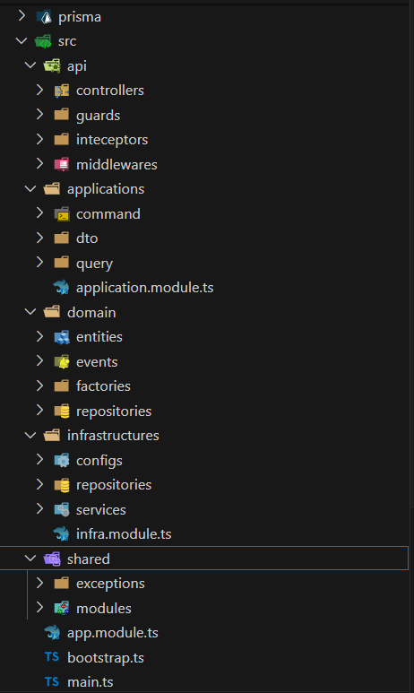
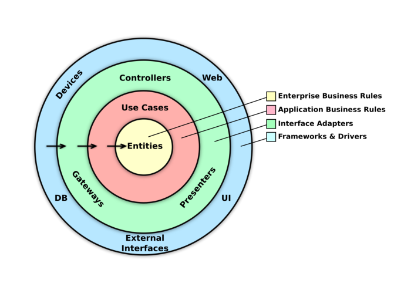
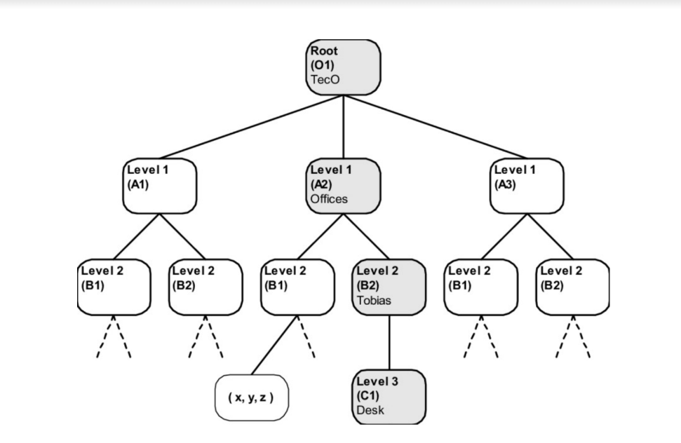
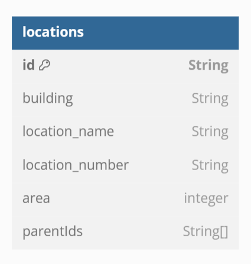
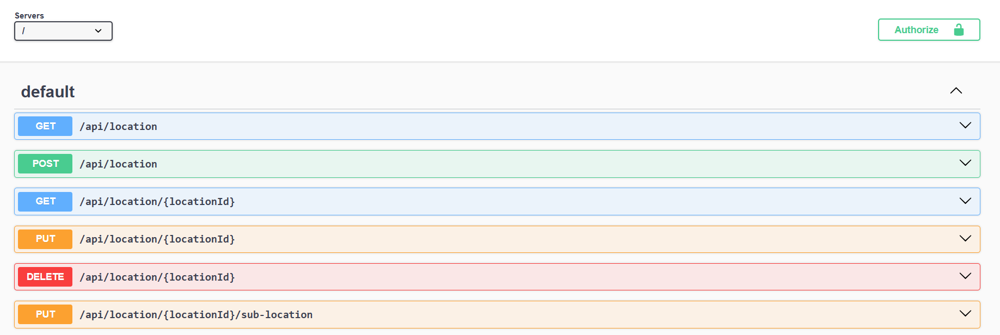

# Documentation

## Architecture

### 1. Folder Structure


| Folder         | Description                                                                                                                                                                                  |
| -------------- | -------------------------------------------------------------------------------------------------------------------------------------------------------------------------------------------- |
| prisma         | Contains the Prisma schema and migration versions.                                                                                                                                           |
| shared         | The shared layer includes utility libraries that can be used in multiple layers of the application. It can be extended by moving it to an npm registry for use across multiple applications. |
| domain         | The domain layer contains domain entities that represent real-life objects (e.g., Location).                                                                                                 |
| application    | The application layer contains application-specific rules.                                                                                                                                   |
| infrastructure | The infrastructure layer implements libraries, persists data to the database, publishes events to queues, etc.                                                                               |
| api            | The API layer includes controllers, guards, interceptors, middleware, etc., and serves as the interface for incoming requests.                                                               |

### 2. Clean Architecture


Based on the folder structure, we have multiple layers to implement. Now, how do these layers communicate with each other?

The core of this architecture is the Entity, which resides in the domain layer. It contains enterprise business logic representing real-life objects. It defines interfaces (e.g., ILocationRepository) but does not implement them. These interfaces are used in the application layer's use cases.

The application layer is responsible for addressing business requirements by orchestrating the business logic. It utilizes repositories provided by the domain layer to formulate commands (for modifying data) and queries (for retrieving data). This layer encapsulates the core business logic, ensuring that all operations conform to the business rules. Commands and queries defined in this layer are invoked by the API layer to perform specific actions and data retrieval tasks, thereby serving as the intermediary between the API layer and the domain layer.

The infrastructure layer manages all framework-specific implementations. It provides concrete implementations of repositories defined by the domain layer (e.g., LocationRepository), enabling data retrieval and modification. This layer serves as an adapter, translating and formatting data between the domain layer and external systems, such as databases, messaging queues, or web services, ensuring seamless integration and interaction with the underlying frameworks and technologies.

The API layer is the interface of the application. It serves incoming requests, checks permissions, handles errors, etc.

### 3. Database Design


The database supports an "address location tree," meaning one record can have multiple children and infinite nesting. To address this, I apply the *Materialized Path* to solve this business use case.

Query *hierarchical database model* can handle complex queries involving nested comments and objects, which traditional parent-child models struggle with due to multiple join operations. The *Materialized Path* offers optimized query performance with a single query to retrieve all nested data.

I chose the *Materialized Path* strategy and utilize PostgreSQL's inverted index to implement it. There are several reasons behind this decision:

- **Simplicity**: This pattern is simple to implement. Instead of storing one parentId, it stores all the parentIds (as an array of strings) related to it. This makes the project easier to maintain.
  - Example:
    - Location "Location 1" has id: 1
    - SubLocation "Location 1.1" (id: 2) has parentIds: [1]
    - SubLocation "Location 1.1.1" (id: 3) has parentIds: [1, 2]
- **Performance**: This implementation offers optimized performance compared to the traditional Parent-Child Model. It might be slightly less optimized than the Nested Set Model but offers safer delete operations by locking only related records instead of the table.



### 4. API


## Deployment
This application uses AWS cloud services, including App Runner, ECR, Webpack to optimize image size and GitHub Actions for deployment.

Deployment URL: [https://fhnypyywvu.ap-southeast-1.awsapprunner.com/docs](https://fhnypyywvu.ap-southeast-1.awsapprunner.com/docs)

## Usage

#### With Docker

**Requirements:** Docker must be installed on your local machine.

**Steps:**
1. Create and fill the `.env` file based on the `.env.template`.
2. Run the following commands:
    ```bash
    docker build -t <IMAGE_TAG> .
    docker run --name <CONTAINER_NAME> -p 3000:3000 <IMAGE_NAME>
    ```
3. Go to [http://localhost:3000/docs](http://localhost:3000/docs) to see the results.

#### With Docker Compose

**Requirements:** Docker must be installed on your local machine.

**Steps:**
1. Run the following commands:
    ```bash
    docker-compose up -d
    ```
2. Go to [http://localhost:3000/docs](http://localhost:3000/docs) to see the results.

